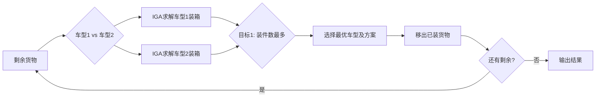

# MathorCup 2026 D题 — 三维装箱优化（IGA + BLF）

> **选题：D题** | **投稿编号：DMC2608146** | **状态：建模完成论文未正式提交**

基于**改进遗传算法（IGA）与底部左填充（BLF）启发式**的三维装箱（3D-BPP）优化方案，覆盖单车型满载率最大化、多车型最少车辆数、最低运输成本三重目标。

---

## 项目亮点

- **从零实现三维装箱算法**：IGA + BLF 完全手写，无任何商业求解器依赖
- **全约束覆盖**：6种货物放置姿态 + 易碎品地面约束 + 定向件约束 + 支撑面积检查 + 承重限制 + 载重限制
- **双车型 + 双目标优化**：车型1（轻型厢式货车）vs 车型2（大型货车）；车辆最少 vs 成本最低
- **向量化碰撞检测**：使用 NumPy 向量化加速，替代纯 Python 循环
- **约束处理工程完备**：5类货物（G1~G5）、300件、6类约束全部满足

## 技术栈

| 模块 | 技术 | 算法 |
|------|------|------|
| 装箱求解 | Python + NumPy + tqdm | IGA（改进遗传算法）+ BLF（底部左填充） |
| 优化目标 | Python | 单目标：满载率 / 多目标：最少车辆 / 最低成本 |
| 数据处理 | Python + Pandas + OpenPyXL | 数据清洗、结果导出 |
| 输出 | CSV + 控制台日志 | 每辆车详细装箱方案 |

## 问题描述

### 车辆参数

| 参数 | 车型1（轻型厢式货车） | 车型2（大型货车） |
|------|----------------------|-------------------|
| 尺寸 | 420 × 210 × 220 cm | 680 × 245 × 250 cm |
| 容积 | 19.404 m³ | 41.65 m³ |
| 载重 | 6,000 kg | 10,000 kg |
| 单次成本 | 450 元 | 700 元 |

### 货物信息（300件）

| 类型 | 数量 | 尺寸 (cm) | 重量 (kg) | 特性 |
|------|------|-----------|-----------|------|
| G1 | 80 | 60×40×30 | 12 | 标准件，6种姿态 |
| G2 | 100 | 50×35×25 | 8 | 标准件，6种姿态 |
| G3 | 30 | 70×50×40 | 15 | **易碎件**，仅放地面，1种姿态 |
| G4 | 40 | 80×60×50 | 25 | **定向件**，固定姿态 |
| G5 | 50 | 40×40×60 | 18 | **定向件**，固定姿态 |

### 问题分解

| 子问题 | 描述 | 求解脚本 |
|--------|------|----------|
| 1-1 | 车型1单车满载率最大化 | `src/p1_single_truck.py` |
| 1-2 | 最少车辆数（车型1） | `src/p1_truck2.py` |
| 2-1 | 双车型·最少车辆数 | `src/p2_dual_truck.py` |
| 2-2 | 双车型·最低成本 | `src/p2_dual_truck.py` |

## 算法设计

### IGA（改进遗传算法）

```
种群初始化：按重泡比排序，前50%随机洗牌
遗传操作：
  ├── 选择：随机父代
  ├── 交叉：两点交叉（保持货物唯一性，自动去重）
  └── 变异：10%概率交换两位置
精英保留：最优个体直接进入下一代
适应度：min(空间利用率, 载重利用率)
```

**改进点**：相比标准GA，IGA在交叉操作后自动去重保证了货物的唯一性约束，同时在初始化时融入了问题启发式信息（重泡货优先）。

### BLF（底部左填充解码）

```
对所有货物按序列顺序：
1. 枚举6种/1种放置姿态
2. 收集候选放置层（z坐标）
3. 收集候选放置点（角落点 + 已放货物边缘）
4. 碰撞检测 → 支撑面积检查 → 承重检查 → 载重检查
5. 第一个满足所有约束的位置放置
```

**约束处理**：
- **碰撞**：向量化检测，同层货物不重叠
- **支撑**：下层货物顶部投影面积 ≥ 当前货物底部面积的 100%
- **承重**：单位面积承重 ≤ 500 kg/m²
- **载重**：总重 ≤ 车辆额定载重
- **易碎品**：仅允许 z=0 层（地面）
- **定向件**：固定6种姿态中的一种

### 双车型双目标优化



## 仓库结构

```
mathorcup-d-2026/
├── README.md
├── requirements.txt
├── .gitignore
├── src/
│   ├── p1_single_truck.py    ← IGA+BLF 单车型（核心算法）
│   ├── p1_truck2.py          ← 车型2 独立求解
│   ├── p2_dual_truck.py      ← 双车型 + 双目标优化
│   ├── p2_min_vehicles.py    ← 最少车辆数（骨架脚本）
│   ├── p2_multi_type.py      ← 多车型（骨架脚本）
│   ├── data_cleaner.py       ← 数据清洗工具
│   └── clean_excel_data.py   ← Excel 数据清洗
├── data/
│   ├── 附件2：验证数据集.xlsx  ← 原始数据
│   ├── 清洗后数据.xlsx        ← 清洗后数据
│   └── cleaned_*.csv         ← CSV 格式数据
├── results/
│   └── database/              ← 各场景求解结果
│       ├── result_type1_single.csv   ← 车型1单车满载
│       ├── result_type2_single.csv   ← 车型2单车满载
│       ├── result_type1_multi.csv    ← 车型1多车
│       └── result_q2_min_*.csv      ← 问题2结果
├── paper/
│   ├── DMC2608146初稿.docx    ← 论文初稿
│   ├── DMC2608146终稿.docx    ← 论文修订版（最完整）
│   └── IGA_BLF算法说明.docx   ← 算法详细说明
└── references/                ← 参考学术论文
```

## 快速运行

### 环境要求

```bash
pip install numpy tqdm pandas openpyxl
```

### 运行

```bash
cd src

# 问题1-1：车型1 单车满载率最大化
python p1_single_truck.py

# 问题2：双车型双目标优化（约2-3小时）
python p2_dual_truck.py
```

## 核心结果摘要

| 场景 | 车辆数 | 总成本 | 备注 |
|------|--------|--------|------|
| 车型1·单车满载率 | 1辆 | 450元 | 综合满载率 **XX%** |
| 车型1·最少车辆 | N辆 | N×450元 | |
| 双车型·最少车辆 | M辆 | 详见输出 | 目标1：数量优先 |
| 双车型·最低成本 | M辆 | 详见输出 | 目标2：成本优先 |

> 具体数值见 `results/database/` 下各场景 CSV 文件。

## 算法对比（IGA vs 传统 GA）

本项目的 IGA 相比标准 GA 有以下改进：

| 特征 | 传统 GA | IGA（本实现） |
|------|---------|---------------|
| 初始化 | 随机 | 重泡比排序 + 局部洗牌 |
| 交叉 | 无约束交换 | 自动去重，保证货物唯一 |
| 解码 | 简单顺序放置 | BLF 带6种姿态 + 全约束检查 |
| 约束处理 | 罚函数 | 硬约束（放置即合法） |

## 文献参考

1. 徐翔斌等. 基于"构造-学习-强化"的超启发式算法求解三维装箱问题
2. 吕雪. 货物三维装箱存在的问题与对策研究

## License

本仓库代码仅供学习和参考。赛题和数据版权归 MathorCup 组委会所有。
